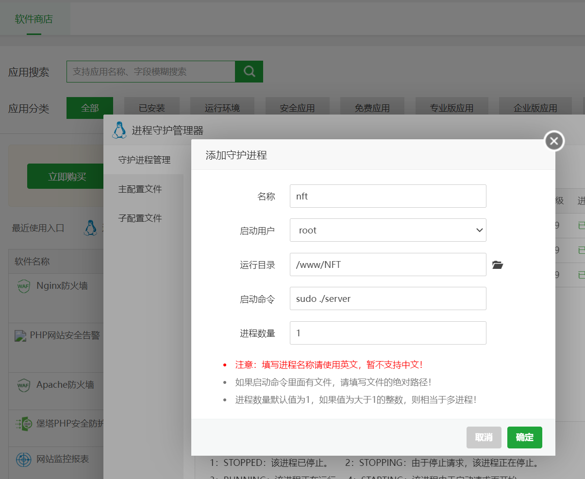

## api

### 运行方法
```
cd api
go build 或 go run main.go

go build 是生成二进制文件，生产环境用
go run main.go 是直接运行，本地开发环境用

supervisor 中添加守护进程（服务器重启，服务会自动启动）

```
#### 接口参考API文档
#### 配置文件：config/config.go
#### 合约ABI转go，contracts/，具体见内说明
